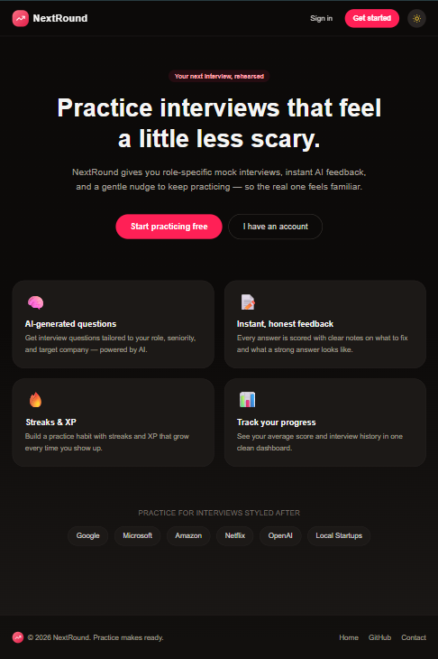
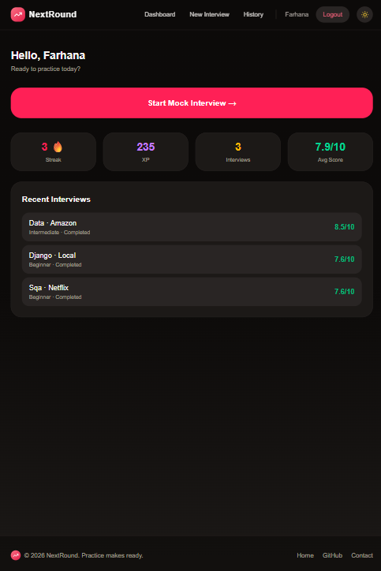
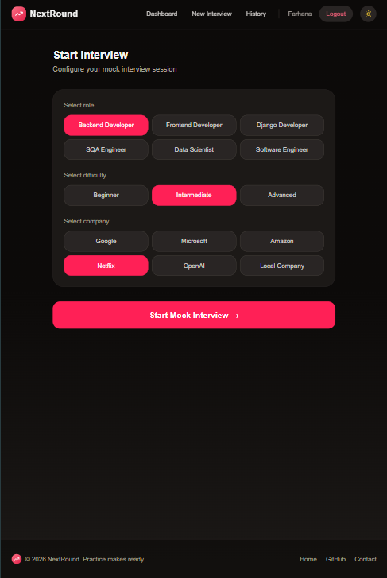
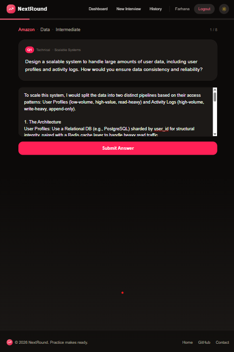
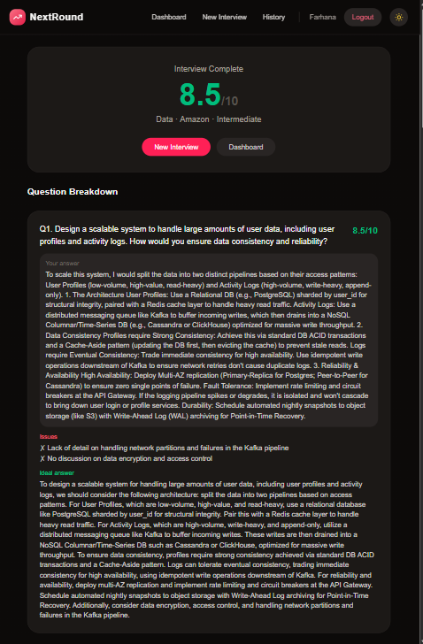
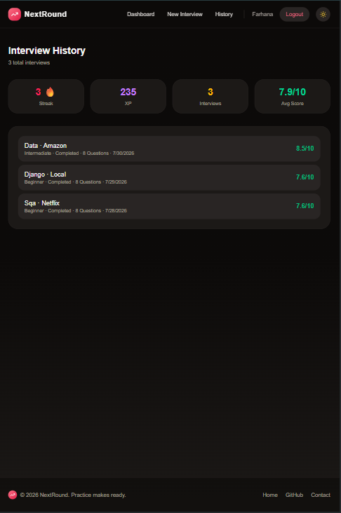

# 🎯 NextRound

**AI-powered Mock Interview & Readiness Tracker**

NextRound generates role-specific interview questions with an LLM, evaluates your answers in real time with structured feedback, and tracks your practice habit over time — built as a full-stack portfolio project demonstrating production-style architecture, authentication, testing discipline, and API design.

🔗 **Live Demo:** [next-round-tau.vercel.app](https://next-round-tau.vercel.app)
📦 **Repository:** [github.com/FarhanaaTasnim/Next-Round](https://github.com/FarhanaaTasnim/Next-Round)


---

## 📸 Screenshots

<table>
  <tr>
    <td align="center" width="50%">
      <br/>
      <sub>Home</sub>
    </td>
    <td align="center" width="50%">
      <br/>
      <sub>Dashboard</sub>
    </td>
  </tr>
  <tr>
    <td align="center" width="50%">
      <br/>
      <sub>New Interview Setup</sub>
    </td>
    <td align="center" width="50%">
      <br/>
      <sub>Interview Session</sub>
    </td>
  </tr>
  <tr>
    <td align="center" width="50%">
      <br/>
      <sub>Results</sub>
    </td>
    <td align="center" width="50%">
      <br/>
      <sub>Interview History</sub>
    </td>
  </tr>
</table>

---

## ✨ Features

- **🧠 AI-Generated Interview Questions** — Eight questions per session, tailored to the candidate's chosen role, difficulty, and target company (Google, Microsoft, Amazon, Netflix, OpenAI, or a generic local company), generated via the Groq API (`llama-3.3-70b-versatile`). Each company profile steers the prompt toward that company's typical focus areas (e.g. system design and scale for Netflix, leadership principles for Amazon).
- **📝 Real-Time, Structured Answer Evaluation** — Every submitted answer is scored 0–10 and returned with a list of concrete problems, a complete model answer, and targeted study tips — not just a bare number.
- **♻️ Resilient AI Integration** — LLM responses aren't always clean JSON. A shared `_call_with_retry` helper strips markdown fences, parses the payload, and — if parsing fails (truncated output, stray commentary, bad escaping) — automatically retries once with a stricter follow-up instruction before giving up.
- **🎮 Full Interview Session Flow** — Configure a session → answer questions one at a time with instant feedback after each → complete the session → review a full per-question breakdown with scores, issues, and ideal answers.
- **📊 History & Analytics Dashboard** — A dedicated dashboard summarizes streak, XP, total/completed interviews, and average score, with a paginated history view (10 sessions per page) for browsing past attempts.
- **🔐 Secure, Email-Based Authentication** — JWT access + refresh tokens via SimpleJWT, backed by a custom `AbstractUser` email-based user model. Axios automatically attaches the bearer token to every request and clears local storage + redirects to `/login` on a `401`.
- **🔥 Gamification Done Correctly** — Streaks increment only on genuinely consecutive days, stay flat on repeat same-day completions, and reset on any gap — verified explicitly in the test suite rather than assumed. XP accrues as `int(score * 10)` per completed session.
- **🌗 Persisted Dark Mode** — Theme preference is detected from system settings on first visit, then persisted and re-applied via Zustand + `localStorage` on every load.
- **🛡️ Defensive API Design** — A failed AI call during session creation rolls the partially-created session back (`session.delete()`) instead of leaving orphaned "pending" sessions in the database; failed evaluations return a clean `502` rather than a raw stack trace.

---

## 🛠 Tech Stack

**Backend**
- Django 6 + Django REST Framework
- SimpleJWT for token-based authentication
- Groq API (`llama-3.3-70b-versatile`) for question generation & answer evaluation
- Celery (task scaffolding) for background/async work
- SQLite locally, PostgreSQL-ready in production via `dj-database-url`
- `django-cors-headers` for cross-origin frontend access

**Frontend**
- React 19 + Vite 8
- React Router 7
- Tailwind CSS 4
- Zustand (auth store + theme store)
- Axios with a request/response interceptor for JWT attach and auth-expiry handling
- lucide-react for iconography

**Testing / Tooling**
- Django `TestCase` + DRF `APIClient` suite (`users/tests.py`, `interviews/tests.py`, `interviews/test_starts_interview.py`) — Groq calls mocked via `unittest.mock.patch` so tests run offline, deterministically, and at zero API cost
- Manual latency instrumentation around `evaluate_answer()` for real-world performance measurement (see [Performance](#-performance) below)

**Deployment**
- Backend on **Render** (Gunicorn + `render.yaml` build/deploy config)
- Frontend on **Vercel** (SPA rewrites via `vercel.json`)

---

## 📁 Project Structure

This is a monorepo with independently deployable frontend and backend services:

```
Next-Round/
├── backend/
│   ├── core/                     # Django settings, URLs, WSGI/ASGI, Celery config
│   ├── users/
│   │   ├── models.py              # Custom email-based User model (streak_days, xp_points, skills, resume, ...)
│   │   ├── views.py               # Register / Login / Profile / Resume upload
│   │   ├── serializers.py
│   │   └── tests.py               # Auth test suite
│   ├── interviews/
│   │   ├── models.py              # InterviewSession, Question, Answer, Feedback
│   │   ├── ai_service.py          # Groq integration: generate_questions, evaluate_answer, retry-on-bad-JSON
│   │   ├── views.py               # Start / Answer / Complete / History / Detail
│   │   ├── tests.py                # Streak + XP + answer-submission test suite
│   │   └── test_starts_interview.py # Session-creation test suite
│   ├── analytics/
│   │   ├── views.py                # Dashboard stats aggregation
│   │   └── serializers.py
│   ├── requirements.txt
│   └── manage.py
└── frontend/
    ├── src/
    │   ├── pages/
    │   │   ├── Home.jsx
    │   │   ├── auth/Login.jsx, Register.jsx
    │   │   ├── Dashboard.jsx
    │   │   ├── InterviewSetup.jsx
    │   │   ├── InterviewRoom.jsx
    │   │   ├── Result.jsx
    │   │   └── History.jsx
    │   ├── components/            # Layout, Navbar, Footer, ThemeToggle, Logo
    │   ├── store/                  # authStore.js, themeStore.js (Zustand)
    │   ├── api/axios.js            # Axios instance + JWT interceptor
    │   └── config.js                # API base URL
    ├── package.json
    └── vite.config.js
```

---

## 🚀 Getting Started Locally

### Prerequisites
- Python 3.12
- Node.js 18+
- A [Groq API key](https://console.groq.com)

### 1. Clone the repository
```bash
git clone https://github.com/FarhanaaTasnim/Next-Round.git
cd Next-Round
```

### 2. Backend setup
```bash
cd backend
python -m venv venv
source venv/bin/activate  # On Windows: venv\Scripts\activate
pip install -r requirements.txt
```

Create a `.env` file in `backend/`:
```env
SECRET_KEY=your-secret-key
GROQ_API_KEY=your-groq-api-key
DEBUG=True
```

Run migrations and start the server:
```bash
python manage.py migrate
python manage.py runserver
```

### 3. Frontend setup
```bash
cd frontend
npm install
```

Create a `.env` file in `frontend/`:
```env
VITE_API_URL=http://localhost:8000
```

Run the frontend:
```bash
npm run dev
```

The app will be available at `http://localhost:5173`.

---

## 🔌 API Overview

| Method | Endpoint | Description |
|--------|-----------|--------------|
| POST | `/api/users/register/` | Create a new account, returns JWT tokens |
| POST | `/api/users/login/` | Authenticate and receive JWT tokens |
| GET | `/api/users/profile/` | Retrieve the authenticated user's profile |
| POST | `/api/users/resume/upload/` | Upload a resume file for the current user |
| POST | `/api/interviews/start/` | Start a new mock interview session (generates questions via Groq) |
| POST | `/api/interviews/<id>/answer/` | Submit an answer for AI evaluation |
| POST | `/api/interviews/<id>/complete/` | Complete the session and update streak/XP |
| GET | `/api/interviews/history/` | Retrieve paginated past interview sessions |
| GET | `/api/interviews/<id>/` | Retrieve full detail for a specific session |
| GET | `/api/analytics/dashboard/` | Retrieve streak, XP, and recent-session stats |

---

## 🧠 How the AI Evaluation Works

1. **Question generation** — role, difficulty, target company, and the candidate's resume skills are compiled into a company-aware prompt, and Groq returns a mixed set of technical, behavioral, and coding questions.
2. **Answer submission** — each answer is sent back to Groq along with the original question, role, and difficulty for context-aware grading.
3. **Structured scoring** — the model returns a 0–10 score, a list of specific problems (empty if the answer is strong), a complete ideal answer, and study tips based on the weak points found.
4. **Parse-and-retry safety net** — if the model's response isn't valid JSON (a truncated stream, stray prose, a stray markdown fence), `_call_with_retry` catches the parse failure, logs it, and re-prompts once with an explicit "return ONLY JSON" instruction before surfacing an error.
5. **Graceful failure** — if Groq is unreachable or returns unparseable output even after the retry, the API responds with a clean `502` and a descriptive `detail` message instead of a raw exception.

---

## ✅ Testing

The backend ships with a Django `TestCase` / DRF `APIClient` suite that mocks all Groq calls, so it runs fully offline, deterministically, and with zero API cost:

| Test module | What it verifies |
|---|---|
| `users/tests.py` | Registration (success, short-password rejection, duplicate-email rejection); login (correct/incorrect/nonexistent credentials); profile access (auth required, correct data returned) |
| `interviews/test_starts_interview.py` | Session + question creation from a mocked AI response; safe defaulting of missing `topic`/`type` fields; session rollback and `502` when the AI service fails; auth enforcement on session creation |
| `interviews/tests.py` — `StreakAndXPTests` | Streak logic across same-day, consecutive-day, and gap-day completions; XP accumulation across multiple sessions; graceful handling of a session with zero answers; ownership enforcement (`404` on another user's session) |
| `interviews/tests.py` — `SubmitAnswerTests` | Feedback creation from a mocked AI evaluation; correct `502` propagation when the AI evaluation call fails |

Run the suite locally:
```bash
cd backend
python manage.py test
```

**Manually stress-tested beyond the committed suite:** the `evaluate_answer()` retry path was verified against a real truncated/invalid JSON response followed by a valid one, confirming a parse failure is caught, logged, and retried exactly once before returning a correctly parsed result — with no silently swallowed or duplicated Groq calls.

---

## 📈 Performance

To confirm the Groq-powered evaluation step isn't a UX bottleneck, `evaluate_answer()` call duration was logged in production across 16 real requests (via `logger.info` on the backend, after confirming Django's root logger level was raised to `INFO` so the timing logs actually surface on Render):

| Metric | Value |
|---|---|
| Samples | 16 |
| Mean | 0.99 s |
| Median | 0.98 s |
| Min | 0.43 s |
| Max | 1.85 s *(single outlier)* |
| Mean (excluding outlier) | ~0.92 s |

**Takeaway:** answer evaluation consistently returns in **under 1.3 seconds** for the large majority of requests, with a typical (median) response around **0.98 s** — sub-second-to-low-single-second feedback that keeps the interview flow feeling responsive, even though the score is computed by a live LLM call rather than a cached or canned response.

---

## 🗺 Roadmap

- [ ] Persistent PostgreSQL database for production data durability
- [ ] Resume-based question personalization (deeper use of parsed skills beyond prompt injection)
- [ ] Video/audio mock interview mode
- [ ] Company-specific interview question banks (curated, beyond prompt-only steering)
- [ ] Automated latency/observability dashboard for the AI evaluation pipeline, replacing manual log sampling

---

## 🤝 Contributing

Contributions, issues, and feature requests are welcome. Feel free to check the [issues page](https://github.com/FarhanaaTasnim/Next-Round/issues).

---

## ⭐ Support

If NextRound helped you, consider giving the repo a star — it helps others find the project!

---

## Author

**Farhana Tasnim**
📧 farhana.tasnim.993@gmail.com
🌐 [Portfolio](https://farhanatasnim.netlify.app)

---

## License

This project is available for educational and portfolio review purposes.
